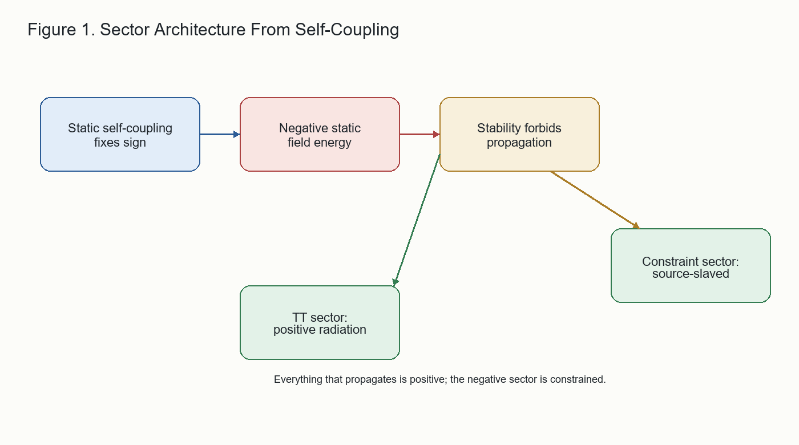

# 1. Introduction

A field theory with a propagating negative-energy mode is normally
unstable. If one sector can carry arbitrarily negative energy while
another carries positive energy, the vacuum can decay into compensating
excitations without bound. This is the standard ghost problem.

Gravity appears to sit close to this danger. In familiar formulations of
general relativity, the conformal or scalar part of the gravitational
field has a wrong-sign character. Yet the theory is not destabilized by a
radiating negative-energy scalar mode. The dangerous sector is constrained;
the physical gravitational waves are transverse-traceless and carry
positive energy.

This paper gives a compact derivation of that architecture from a
self-consistency bootstrap. The argument has four steps.

First, the static self-coupling of the exterior field forces a negative
local energy density in the scalar/static sector,

$$
u_{\rm stat}=-\frac{c^4}{8\pi G}(s')^2 .
$$

Second, if this sector is promoted to a propagating hyperbolic field, the
Hamiltonian is unbounded below. Stability therefore forces the sector to
be elliptic: it is a constraint, not radiation.

Third, the source-free static constraint has flat vacuum as its unique
regular asymptotically flat solution. The negative sector is therefore
source-bound. It cannot be mined as an independent energy reservoir.

Fourth, the transverse-traceless sector is positive and carries outward
null flux. Its sign is fixed by positivity, while its normalization is
fixed only by a second-order self-coupling argument; linear radiation
theory alone cannot determine it.

The point is not that gravity has positive local energy in every sector.
It does not. The point is that sign and dynamical character are locked
together. The negative sector is non-propagating and source-bound; the
propagating sector is positive.

The derivation was developed inside the Vacuum Energy Dynamics archive,
but the argument below is intentionally presented in a minimal form. The
reader need not accept the larger ontology to follow the sector theorem.
The archive matters here mainly as provenance: the algebraic claims are
implemented in scripts that rederive the stated identities and sign checks
from scratch.

Figure 1 summarizes the proof structure.

