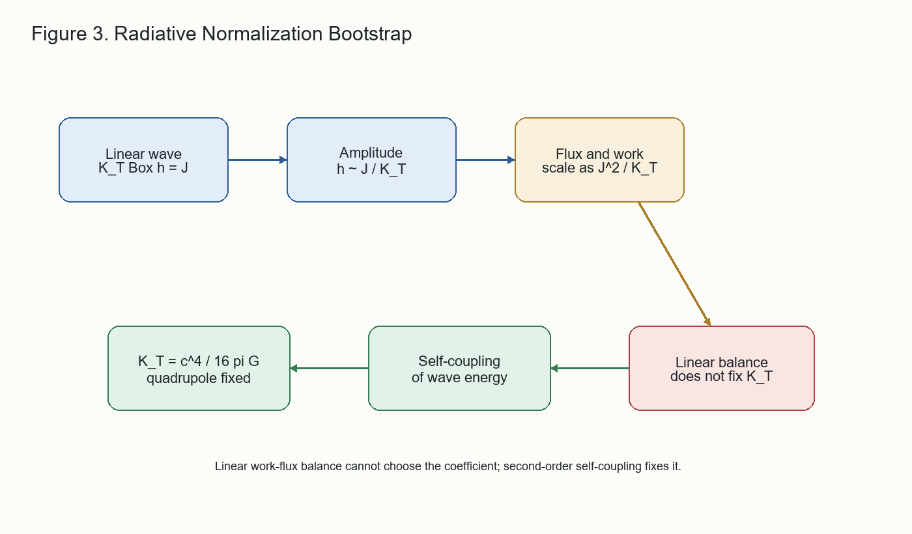

# 7. The Normalization Gap: Why Linear Radiation Theory Cannot Fix `K_T`

The sign of the radiative sector is fixed by positivity. Its normalization
requires one more step. A useful way to see the issue is to write the
linear TT equation schematically as

$$
K_T \Box h = J ,
$$

where $J$ is the source and $K_T$ is the kinetic normalization. At linear
order the amplitude scales as

$$
h\sim\frac{J}{K_T}.
$$

The radiated energy flux is quadratic in the wave amplitude but linear in
the kinetic normalization:

$$
{\cal F}\sim K_T \dot{h}^2
\sim K_T\left(\frac{J}{K_T}\right)^2
\sim \frac{J^2}{K_T}.
$$

The work done on the source by the radiative field has the same scaling,

$$
P_{\rm work}\sim J\dot{h}\sim \frac{J^2}{K_T}.
$$

Therefore the linear work-flux balance can hold for every value of
$K_T$. The linear theory can verify consistency, but it cannot select the
normalization. The only physical combination visible at this order is the
source coupling squared divided by $K_T$.

This is the underdetermination lemma. It explains why simply checking that
radiation carries away the work done by sources is not enough to determine
the coefficient in the gravitational-wave energy density.

The normalization is fixed only when the wave's own energy is required to
gravitate at the same universal coupling as every other form of energy.
In the reduced bootstrap, the static sector first fixes the geometric
response normalization

$$
N=\frac{c^4}{8\pi G}.
$$

Expanding the same response to second order in a TT wave then reads the
wave energy from the quadratic part of the field equation. Equivalently,
the wave's second-order stress must source the background at coupling
$N$. This fixes

$$
K_T=\frac{c^4}{16\pi G},
$$

with the corresponding averaged energy density

$$
u_{\rm TT}
=\frac{c^2}{32\pi G}
\left\langle
\dot{h}_{ij}^{\rm TT}\dot{h}_{ij}^{\rm TT}
\right\rangle .
$$

Once this coefficient is fixed, the quadrupole chain contains no free
normalization:

$$
P=\frac{G}{5c^5}
\left\langle
\dddot{Q}_{ij}\dddot{Q}_{ij}
\right\rangle ,
$$

up to the usual trace-free quadrupole convention. Observations such as
binary-pulsar spin-down then function as kill conditions rather than as
fits.

The underdetermination lemma and the second-order normalization bootstrap
are verified in `radiative_bootstrap_KT.py`.

Figure 3 summarizes the normalization logic.

