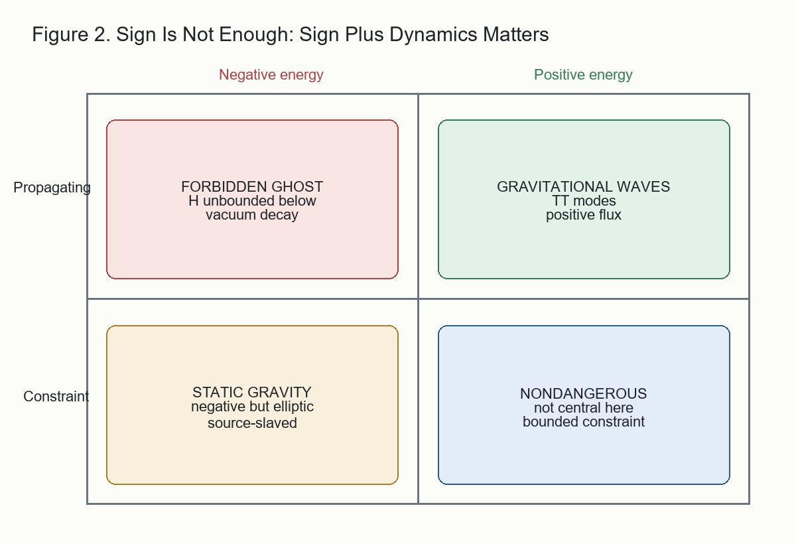

# 8. The Complete Sector Architecture

The argument so far gives a sector assignment, not merely a list of signs.
The architecture is summarized in Table 1.

| sector | energy sign | dynamical character | reason |
|---|---:|---|---|
| static scalar/shear `s` | negative | elliptic constraint | self-coupling fixes `u_stat < 0`; stability forbids propagation |
| source-free static sector | none independently | source-bound | regular asymptotically flat zero-source solution is `A = 1` |
| transverse-traceless radiation | positive | hyperbolic propagating | quadratic energy is a sum of squares and flux is outward |
| vector/momentum sector | bounded magnetic-type | constraint-sourced | sourced by momentum density, not an independent scalar reservoir |
| trace/kappa sector | suppressed in strict statics | constrained/quarantined | static frame indifference removes the static trace channel |

The important feature is not positivity of every sector. Gravity is not
positive definite at the level of local static field energy. The important
feature is that the indefinite sectors have the only dynamical character
compatible with stability.

The negative sector is allowed because it is constrained and source-bound.
The positive sector propagates because it is bounded below. A theory that
changed either assignment would be unstable or empirically wrong:

- negative and propagating gives a ghost;
- negative and constraint gives ordinary static gravity;
- positive and propagating gives gravitational radiation;
- source-free negative reservoirs are absent by uniqueness.

This is the compact answer to the conformal-factor puzzle. The wrong-sign
sector is not a physical radiative degree of freedom. It belongs to the
constraint structure.

The result also explains why a derivation of the radiative coefficient
must go beyond linear theory. The linear TT sector is consistent for any
`K_T`, but self-coupling of the wave's own energy fixes the coefficient.
Thus the final stable architecture is sector-indefinite and
self-normalizing:

```text
negative static sector -> constraint
positive TT sector     -> radiation
self-coupling          -> normalization
```

This is the structure that the later full field-equation derivation closes
into the Einstein-Hilbert response. The present paper does not require the
reader to accept that full closure. Its narrower claim is that the sector
assignment itself follows from the static bootstrap, stability, and
self-coupled radiation bookkeeping.

Figure 2 separates the sign question from the dynamical-character
question.


