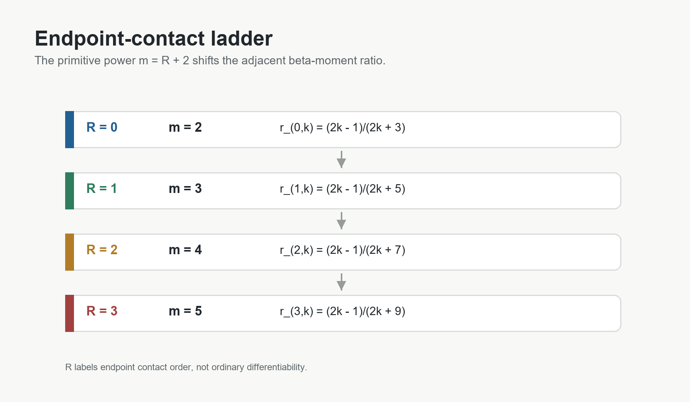

# 4. Boundary Regularity and the Ladder

The higher coefficients are indexed by endpoint contact order.  The primitive
family is

```text
G_{k,m}(x) = x^(2k-1)(1-x^2)^m.
```

The associated two-term survivor ratio is

```text
r_{k,m} = (2k - 1)/(2k + 2m - 1).
```

The endpoint-contact index is related to this primitive power by

```text
m = R + 2.
```

Therefore

```text
r_{R,k} = (2k - 1)/(2k + 2R + 3).
```

Equivalently, in the `y` variable,

```text
r_{R,k}
  = B(k + 1/2, R + 2)/B(k - 1/2, R + 2).
```

The first few levels are:

| Contact level | Primitive power | Survivor ratio |
| --- | ---: | --- |
| `R = 0` | `m = 2` | `(2k - 1)/(2k + 3)` |
| `R = 1` | `m = 3` | `(2k - 1)/(2k + 5)` |
| `R = 2` | `m = 4` | `(2k - 1)/(2k + 7)` |
| `R = 3` | `m = 5` | `(2k - 1)/(2k + 9)` |

This ladder should not be read as ordinary `C^R` smoothness.  In the
originating boundary reduction, a transformed variable can be smooth while
the source has only the base contact order at the endpoint.  The label `R`
records extra endpoint suppression in the source/admissibility class.



