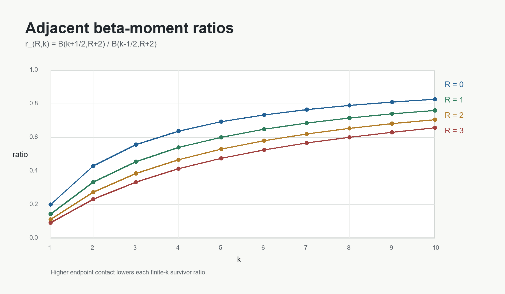

# 5. Moment Hierarchy Interpretation

The ladder is a standard beta-moment hierarchy.  Let

```text
mu_{R,k} = int_0^1 y^k (1-y)^(R+1)y^(-1/2) dy.
```

Then

```text
mu_{R,k} = B(k + 1/2, R + 2)
```

and

```text
mu_{R,k}/mu_{R,k-1}
  = (k - 1/2)/(k + R + 3/2)
  = (2k - 1)/(2k + 2R + 3).
```

Thus the two-term row

```text
y^k - r_{R,k}y^(k-1)
```

is exactly the monic polynomial obtained by subtracting the component detected
by the adjacent moment ratio.

The hierarchy also has a compact product form for the verification pairing
moments.  For example,

```text
beta(s) = B(s + 1/2, 5)
        = 24 Gamma(s + 1/2)/Gamma(s + 11/2).
```

For integer `s`, this can be written as a reciprocal product over five
half-integer factors.  Such product forms are useful for exact symbolic
verification, but they are not the conceptual source of the ladder.  The
conceptual source is the adjacent beta-moment ratio.



