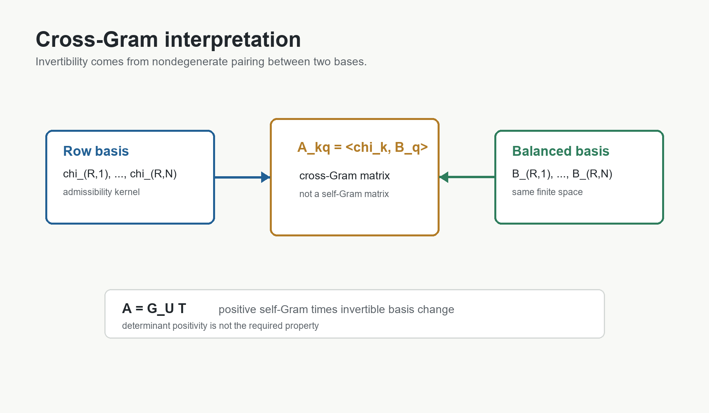

# 7. Cross-Gram Structure

Let `H_{R,N}` be the finite admissible polynomial space under consideration.
The row family and the balanced source family give two bases of this same
finite-dimensional space:

```text
U_{R,N} = (chi_{R,1}, ..., chi_{R,N}),
V_{R,N} = (B_{R,1}, ..., B_{R,N}).
```

The pairing

```text
<P,Q>_R = int_0^1 P(y)Q(y)W_R(y) dy
```

is positive definite on nonzero polynomials because `W_R(y) > 0` on `(0,1)`.
The projection matrix is therefore

```text
A^{(R,N)}_{kq} = <chi_{R,k}, B_{R,q}>_R.
```

This is a cross-Gram matrix.  It is not the self-Gram matrix of one basis.
Consequently, determinant positivity is not the relevant invariant.

If `G_U` is the self-Gram matrix of the row basis and `T` is the change of
coordinates from the balanced basis to the row basis, then

```text
A = G_U T.
```

The self-Gram matrix `G_U` is positive definite and hence invertible.  The
change-of-basis matrix `T` is invertible because both families are bases of
the same finite admissible space.  Therefore `A` is invertible.

This is the core mechanism.  The finite projection systems are solvable
because the two coordinate families span the same admissible space under a
nondegenerate weighted pairing.



