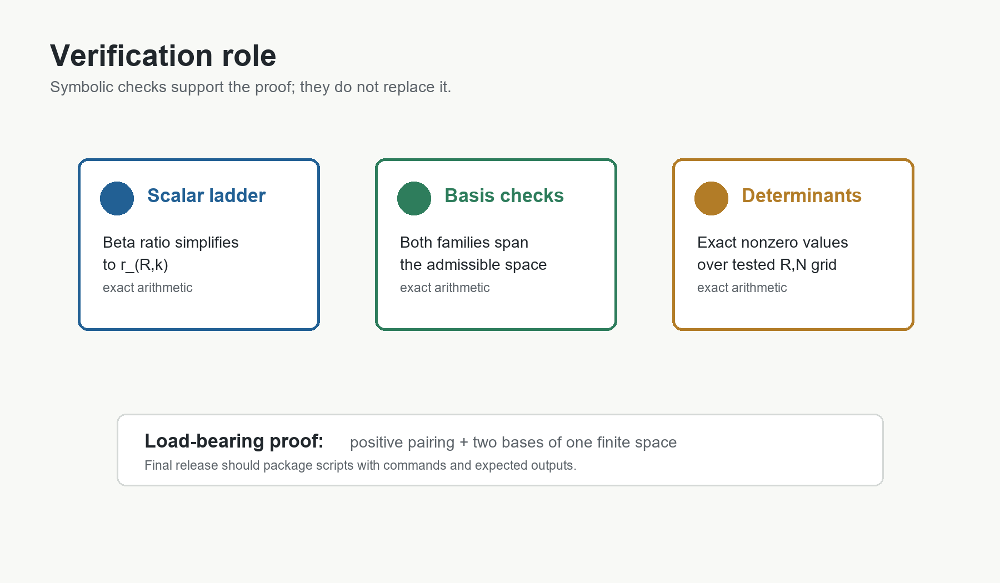

# 9. Symbolic Verification

The verification branch checks three claims.

First, the scalar ladder satisfies

```text
B(k + 1/2, R + 2)/B(k - 1/2, R + 2)
  = (2k - 1)/(2k + 2R + 3).
```

Second, for `R = 0`, the row family and the balanced source family both span
the finite first-admissibility kernel through the tested orders.  The
corresponding cross-Gram determinants were nonzero in exact arithmetic.

Third, the generalized cross-Gram determinants were checked for

```text
R = 0,1,2,3,4
```

over the tested finite orders.  Each tested determinant was nonzero.

These scripts are not substitutes for the all-orders argument in Section 8.
Their role is to guard against transcription errors, confirm that the finite
families used in the proof match the discovered matrices, and preserve the
provenance of the formulae.

The figure scripts in `paper_drafts/05/src_fig` are independent visual
summaries of the same facts.  They do not perform proof verification.



